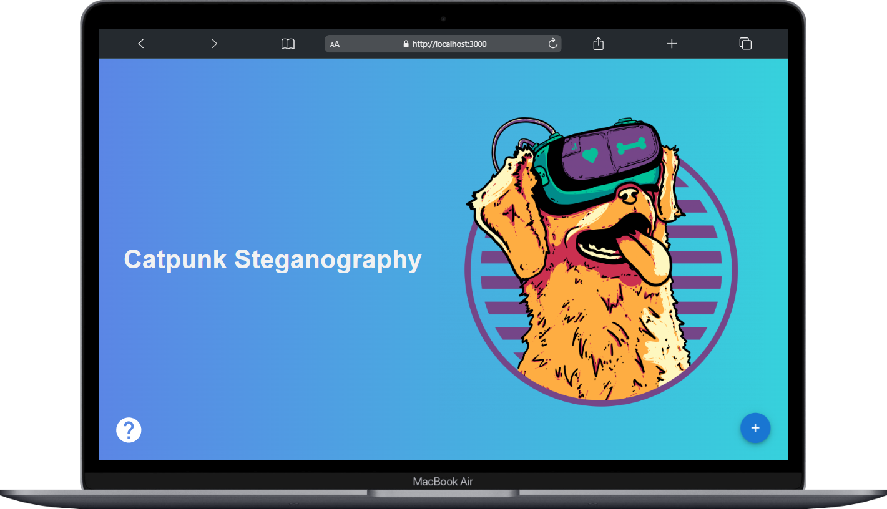
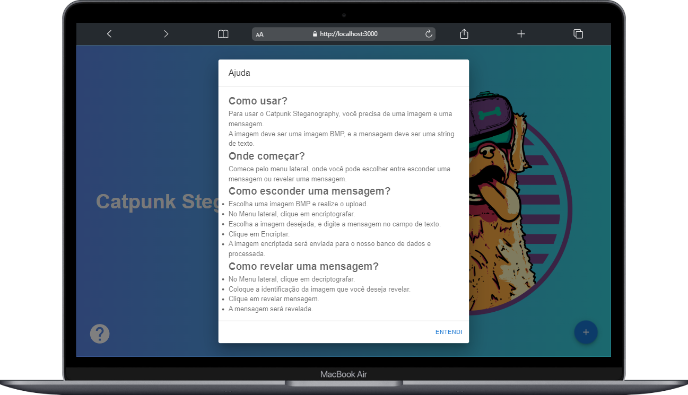

#  Catpunk Steganography

Sistema para criptografia de mensagem através de imagens utilizando a técnica de esteganografia, mais precisamente, esteganografia em imagens utilizando o
algoritmo LSB (Apêndice A, Least Significant Bit)


## Rodando localmente

Clone o projeto

```bash
  git clone git@github.com:wendryosales/steganography.git
```

Entre no diretório do projeto

```bash
  cd steganography
```

Instale as dependências do frontend

```bash
  cd frontend
```
```bash
  npm install
```

## Rodando Containers Docker

Após Clonar o repositório e instalar as dependências do frontend

Suba os containers do banco e os servidores com o comando:

```bash
  make start
```

Este comando irá rodar o docker-compose subindo 3 containers: front, back e db.
Certifique-se que está tudo ok com os containers antes de prosseguir.

Realize as migrates do django rest dramework com:

```bash
  make migrate
```

Crie um superuser caso tenha interesse em acessar o admin:

```bash
  make createsuperuser
```

Caso tenha qualquer problema com os comandos listados no Makefile, você pode utilizar os comando no shell copiando do próprio arquivo.


## Documentação da API

#### A api está rodando na porta 8000

```http
  GET http://localhost:8000/api/
```

as rotas disponíveis estarão listadas caso acesse pelo browser.

Utilizando pelo browser você irá conseguir visualizar toda documentação pronta do django e também enviar requests.

Todas as rotas estão sem autenticação para facilitar a testagem.


## Screenshots






## Autores

- [@wendryo](https://www.linkedin.com/in/wendryosales/)

